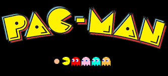

# Prycts

## Descripción

En este repositorio esta alojado el proyecto del videojuego PacMan de la materia Programación Avanzada

## Notas

Se necesita la instalación de diversas herramientas como :

- Plantuml
- C++
- Material Icon

El juego consiste en conducir a Pac-Man, una bola amarilla que abre y cierra la boca, por un laberinto. Suma puntos cuando come aquello que encuentra a su paso, bolitas y diferentes frutas, pero debe esquivar a cuatro fantasmas.